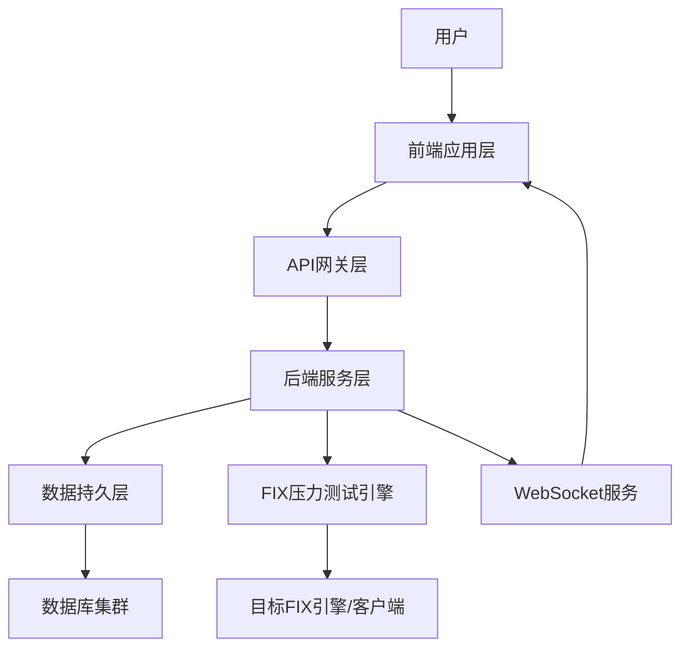

# QuickFIX/J 压力测试系统前后端完整需求文档

## 目录


1.  引言

    1.1 文档目的

    1.2 适用范围

    1.3 术语与缩写

    1.4 参考资料

2.  系统总体架构

    2.1 架构模式

    2.2 前后端职责划分

    2.3 技术栈选型建议

3.  前端功能需求

    3.1 测试计划管理模块

    3.2 核心参数配置模块

    3.3 测试执行控制模块

    3.4 实时监控面板模块

    3.5 测试结果分析模块

    3.6 系统设置模块

4.  后端功能需求

    4.1 接口层设计

    4.2 业务服务层设计

    4.3 数据持久层设计

    4.4 安全控制层设计

    4.5 性能保障层设计

5.  前后端交互流程

    5.1 测试计划创建流程

    5.2 测试任务启动流程

    5.3 实时监控数据推送流程

    5.4 测试结果导出流程

6.  部署与运维需求

    6.1 环境要求

    6.2 部署架构

    6.3 监控与告警

    6.4 数据备份与清理

7.  附录

    7.1 接口列表汇总

    7.2 数据字典

    7.3 异常码定义


***

## 1. 引言

### 1.1 文档目的

本文档明确 QuickFIX/J 压力测试系统的前后端完整需求，包括架构设计、功能模块、接口定义、交互流程及部署要求，为前端开发、后端开发、测试验证、运维部署提供统一技术依据，确保系统满足金融行业 FIX 引擎压力测试的性能、可靠性与合规性要求。

### 1.2 适用范围


*   **系统对象**：基于 QuickFIX/J 1.6.x 及以上版本的 FIX 引擎 / 客户端压力测试系统

*   **用户角色**：前端开发工程师、后端开发工程师、测试工程师、运维工程师、业务分析师

*   **业务场景**：金融行业股票、期货、债券等业务的 FIX 协议并发会话、高 TPS、长时间稳定性等压力测试场景

### 1.3 术语与缩写


| 术语 / 缩写   | 全称 / 含义                                           |
| --------- | ------------------------------------------------- |
| TPS       | Transactions Per Second，每秒消息处理数                   |
| FIX       | Financial Information eXchange，金融信息交换协议           |
| RESTful   | Representational State Transfer，表述性状态转移（API 设计风格） |
| WebSocket | 一种在单个 TCP 连接上进行全双工通信的协议（用于实时数据推送）                 |
| JVM       | Java Virtual Machine，Java 虚拟机                     |
| P99 延迟    | 99% 的消息延迟不超过该数值（性能指标）                             |
| API       | Application Programming Interface，应用程序编程接口        |

### 1.4 参考资料


*   《QuickFIX/J User Guide》（QuickFIX/J 官方文档）

*   《FIX Protocol Specification 4.2/4.4/5.0SP2》（FIX 协议规范）

*   《RESTful API 设计最佳实践》

*   《WebSocket 协议规范（RFC 6455）》


***

## 2. 系统总体架构

### 2.1 架构模式

采用**前后端分离架构**，前端负责用户交互与数据可视化，后端负责业务逻辑处理、压力测试执行与数据存储，通过标准化 API 实现数据交互，架构分层如下：




### 2.2 前后端职责划分


| 层级  | 前端职责                                                         | 后端职责                                                                                         |
| --- | ------------------------------------------------------------ | -------------------------------------------------------------------------------------------- |
| 交互层 | 1. 测试计划可视化配置2. 测试执行状态展示与控制3. 监控数据图表渲染4. 测试结果导出与展示5. 用户权限管理界面 | 1. 接收前端请求并处理业务逻辑2. 调度 FIX 压力测试任务3. 采集系统资源与业务指标4. 存储测试数据与日志5. 通过 WebSocket 推送实时数据6. 接口鉴权与安全控制 |
| 数据层 | 1. 本地缓存常用配置（如消息模板）2. 临时存储前端输入数据                              | 1. 数据库表设计与数据存储2. 时序数据（监控指标）管理3. 日志数据持久化4. 数据备份与清理                                            |
| 保障层 | 1. 前端表单校验2. 页面加载优化3. 异常提示友好化                                 | 1. 并发任务调度2. 过载保护与资源隔离3. 异常捕获与告警4. 服务高可用保障                                                    |

### 2.3 技术栈选型建议


| 层级  | 技术栈建议                                                                                                                                                 | 选型理由                            |
| --- | ----------------------------------------------------------------------------------------------------------------------------------------------------- | ------------------------------- |
| 前端  | 1. 框架：Vue 2 + Vuex2. 组件库：Element UI 3. 图表：ECharts（监控可视化）4. 通信：Axios（RESTful）、WebSocket API5. 构建：npm/yarn                                             | 轻量化、高性能、组件丰富，适配金融级数据可视化需求       |
| 后端  | 1. 语言：Java 8/112. 框架：Spring Boot 2.x + Spring Cloud（微服务可选）3. FIX 引擎：QuickFIX/J 1.6.x+4. 通信：Spring Web（RESTful）、Spring WebSocket5. 任务调度：Quartz（定时测试任务） | 金融行业主流技术栈，稳定性高，适配 QuickFIX/J 生态 |
| 数据库 | 1. 关系型：MySQL 8.0（测试计划、用户数据）2. 时序型：InfluxDB（监控指标，高写入性能）3. 日志：Elasticsearch（海量日志存储与检索）                                                                  | 分场景适配数据存储需求，兼顾事务性与高性能           |
| 部署  | 1. 前端：Nginx + 静态资源 CDN2. 后端：Docker + Kubernetes（集群部署）3. 网关：Spring Cloud Gateway                                                                       | 支持高可用部署，便于横向扩展与运维               |


***

## 3. 前端功能需求

### 3.1 测试计划管理模块

#### 3.1.1 计划创建与编辑


*   支持填写计划基础信息：计划名称（唯一）、业务场景描述、FIX 协议版本（下拉选择：4.2/4.4/5.0SP2）、测试负责人（关联系统用户）、计划标签（可自定义，如 “峰值测试”“稳定性测试”）

*   支持从模板创建：左侧展示 “模板库”（如 “100 会话 500TPS 模板”“24 小时稳定性模板”），点击模板自动填充基础配置，支持模板预览（显示核心参数：会话数、TPS 范围、消息比例）

*   支持计划状态管理：草稿→已配置→待启动→执行中→已完成→执行失败，不同状态用颜色标注（草稿 - 灰色、执行中 - 绿色、失败 - 红色）

#### 3.1.2 计划查询与操作


*   支持多条件筛选：按计划名称（模糊查询）、状态、协议版本、创建时间（时间范围）筛选

*   支持计划操作：查看详情、编辑（仅草稿 / 已完成状态）、复制（生成新计划）、删除（仅草稿 / 已完成状态）、导出配置（JSON 格式）

### 3.2 核心参数配置模块

采用**向导式分步配置**（3 步：会话配置→流量配置→执行设置），步骤进度条显示当前位置，支持 “上一步 / 下一步” 切换，关键参数旁提供 “问号提示”（hover 显示说明）。

#### 3.2.1 并发会话配置（步骤 1）


*   会话数量控制：滑块 + 输入框双控（范围 10\~1000），实时显示当前值

*   会话 ID 配置：


    *   生成规则：支持 “按序号递增”（如 SenderCompID=CLIENT\_001\~CLIENT\_100，TargetCompID 固定）或 “导入 CSV”（上传包含 SenderCompID/TargetCompID 的 CSV，前端预览并校验格式）

    *   重复校验：前端实时校验会话 ID 唯一性，重复时提示 “会话 ID 已存在，请修改”

*   连接策略：


    *   批量登录：下拉选择 “立即全部登录”“梯度登录”（配置登录间隔，如 100 会话每 2 秒登录 10 个）、“随机登录”（配置登录时长范围，如 10\~30 秒）

    *   自动重连：勾选后配置 “重连间隔（5\~30 秒）”“最大重连次数（1\~20 次）”，提示 “超过最大次数将标记会话失败”

#### 3.2.2 消息流量配置（步骤 2）


*   TPS 阶梯配置：


    *   表格化编辑：支持新增 / 删除阶梯行，每行配置 “目标 TPS（1\~5000）”“持续时长（1\~60 分钟）”“备注”

    *   实时计算：表格下方显示 “总测试时长”（所有阶梯时长之和）

    *   曲线预览：点击 “预览 TPS 曲线” 弹出折线图，展示 TPS 随时间变化趋势

*   消息类型配置：


    *   比例控制：环形图 + 百分比输入框，配置 NewOrderSingle（35=D）、CancelOrder（35=F）、ReplaceOrder（35=G）、ExecutionReport（35=8）占比（总和强制 100%，输入一个值后其他自动调整）

    *   大消息设置：勾选 “启用大消息测试” 后，配置 “消息尺寸（1\~10KB，滑块）”“大消息占比（0\~50%）”，提示 “大消息可能导致 TPS 衰减”

*   自定义字段配置：


    *   新增字段：点击 “添加字段”，输入 “字段标签”“FIX 字段 ID”“值生成规则”（下拉：随机数 / 枚举值 / 递增序列，枚举值支持手动输入多选项）

    *   字段管理：支持编辑 / 删除已添加的自定义字段

#### 3.2.3 执行设置配置（步骤 3）


*   启动方式：


    *   立即启动：点击后直接提交后端执行

    *   定时启动：时间选择器（未来 1 小时～7 天），显示 “预计启动时间” 及倒计时

*   启动前校验：


    *   前端自动校验：必填参数完整性、TPS 阶梯合理性（如后续阶梯 TPS 不小于前序）、会话 ID 唯一性

    *   校验失败提示：红色文字标注失败项（如 “TPS 阶梯递减，请调整”），阻止进入下一步

*   自动停止条件：


    *   时长停止：配置 “最大持续时长（1\~72 小时）”，超时自动停止

    *   异常停止：配置 “消息丢失率≥1%”“延迟 P99≥500ms”“会话断开率≥5%”，触发任一条件自动停止

*   紧急控制：


    *   生成 “紧急停止令牌”（唯一字符串），用于手动停止时权限验证（避免误操作）

    *   令牌展示：支持复制，提示 “请妥善保存，用于紧急停止测试”

### 3.3 测试执行控制模块

#### 3.3.1 启动前确认


*   确认弹窗：点击 “启动测试” 后弹出，展示 “计划名称、核心参数摘要（会话数、目标 TPS、总时长）、执行风险提示（如 “高 TPS 可能占用大量资源，建议非业务时段执行”）”

*   环境检查：


    *   点击 “环境检查” 按钮，前端调用后端接口检查：目标 FIX 引擎在线状态、服务器资源（CPU≤70%、内存≤60%）、网络连通性

    *   检查结果展示：绿色 “通过”/ 红色 “失败”，失败项提供排查建议（如 “FIX 引擎离线，请联系运维启动”）

*   日志展示：确认启动后，实时加载后端返回的启动日志（如 “初始化 100 个会话→加载消息模板→执行第 1 阶梯 50TPS”），支持复制 / 下载日志

#### 3.3.2 执行中控制


*   状态展示：页面顶部显示 “当前状态（执行中 / 暂停中）”“已运行时间”“剩余时间”“当前 TPS 阶梯”，进度条展示测试完成比例

*   暂停 / 恢复：


    *   点击 “暂停”：发送请求至后端，暂停消息发送，状态更新为 “暂停中”，记录暂停时长

    *   点击 “恢复”：从当前阶梯剩余时间继续执行，更新 “已运行时间”

*   紧急停止：


    *   红色按钮：点击后弹出 “输入紧急停止令牌” 弹窗，验证通过后发送停止请求

    *   停止日志：实时显示 “停止消息发送→清理会话连接→生成初步结果”，停止完成后状态更新为 “已完成”

### 3.4 实时监控面板模块

#### 3.4.1 监控图表展示

采用 “分区域布局”，支持图表缩放（鼠标滚轮）、时间范围切换（近 5 分钟 / 1 小时 / 24 小时）、刷新频率调整（1 秒 / 5 秒 / 10 秒）。


| 监控区域  | 图表类型                                | 展示内容                                                                                                            |
| ----- | ----------------------------------- | --------------------------------------------------------------------------------------------------------------- |
| 系统资源区 | 堆叠折线图（CPU）、面积图（内存）、双轴折线图（网络 IO）     | 1. CPU：各核心使用率（0\~100%）2. 内存：堆 / 非堆内存使用量（已用 / 总容量）3. 网络 IO：发送 / 接收字节数（KB/s）                                      |
| 业务指标区 | 折线图（TPS）、箱线图（延迟）、饼图（成功率）、数字卡片（会话状态） | 1. TPS：实时 TPS 趋势（标注当前值 / 峰值）2. 延迟：P50/P90/P95/P99 延迟分布3. 成功率：消息成功 / 失败占比（标注成功率数值）4. 会话状态：在线数 / 断开数 / 重连数（断开数标红） |

#### 3.4.2 异常告警与数据钻取


*   异常告警：


    *   指标触发阈值时（如延迟 P99≥500ms），对应图表边框红色闪烁，弹出悬浮通知（显示 “异常指标：延迟 P99，当前值：520ms，阈值：500ms”）

    *   通知支持 “查看详情”：跳转至异常时间段的详细数据页

*   数据钻取：


    *   TPS 图表：点击某时间点，弹出 “该时间点详情”（发送数 / 接收数 / 丢失数 / 重传数），支持按消息类型筛选

    *   会话卡片：点击 “在线数 / 断开数”，跳转至 “会话详情页”（显示所有会话 ID、状态、发送 / 接收数、断开次数），支持按状态筛选

*   实时日志流：


    *   按时间倒序展示消息级日志（如 “\[10:05:30] 会话 CLIENT\_001 发送 NewOrderSingle，ClOrdID=12345，延迟 80ms”）

    *   支持筛选：按会话 ID、消息类型、处理结果（成功 / 失败），筛选条件可保存为 “常用筛选器”（如 “仅看失败消息”）

### 3.5 测试结果分析模块

#### 3.5.1 结果汇总展示


*   核心指标卡片：展示 “平均 TPS、峰值 TPS、延迟 P99、消息成功率、会话重连成功率、异常次数”，每个指标标注 “评级”（优秀≥99.99%/ 良好 99.9%\~99.99%/ 合格 99%\~99.9%/ 不合格 < 99%）及 “对比基准”（如与历史最优值对比：“提升 5%”）

*   结果摘要：自动生成测试结论（如 “500TPS 压力下持续 24 小时，成功率 99.99%，延迟 P99 180ms，无会话异常，满足要求”），支持编辑补充人工分析

#### 3.5.2 详细数据与导出


*   详细表格：


    *   时间粒度表：按分钟 / 小时统计 TPS、延迟、成功率

    *   消息类型表：按类型统计发送数 / 接收数 / 失败数 / 重传数

    *   会话详情表：按会话 ID 统计在线时长 / 消息数 / 断开次数

    *   表格功能：支持排序（列头点击）、筛选（关键词 / 下拉）、分页（10/20/50 条 / 页）、复制数据


#### 3.5.3 历史结果对比


*   历史记录查询：


    *   列表展示：按执行时间倒序，显示计划名称、执行时间、核心指标（平均 TPS / 成功率）、评级，支持按协议版本 / 测试类型 / 评级筛选

    *   详情查看：点击列表项进入 “历史结果详情页”（与当前结果页格式一致）

*   多结果对比：


    *   勾选多个历史结果，点击 “对比分析”，跳转至对比视图

    *   对比图表：雷达图（多指标对比）、折线图（相同 TPS 阶梯性能差异）、表格（指标数值对比）

    *   对比报告：支持导出 PDF（含对比图表与结论），用于性能优化验证（如 “JVM 优化后延迟 P99 从 250ms 降至 180ms”）

### 3.6 系统设置模块


#### 3.6.1 基础配置管理


*   协议版本管理：支持 FIX 协议版本（如 FIX 4.4），配置该版本下的必填字段、消息类型映射

*   消息模板管理：支持新增 / 编辑 / 删除消息模板（如 “市价买入订单模板”），模板包含固定字段值（如 OrderType=1），支持导入 / 导出（JSON 格式）

*   告警配置：支持配置异常告警方式（邮件 / 短信 / 前端通知），设置告警接收人、告警阈值（如 GC 耗时 > 1s 触发告警）


***

## 4. 后端功能需求

### 4.1 接口层设计

采用**RESTful API**（同步请求）+ **WebSocket**（实时推送）组合，所有接口统一前缀`/api/v1`，支持 HTTPS 加密传输。

#### 4.1.1 RESTful API 接口（核心接口列表）


| 接口 URL                         | 请求方法 | 接口描述   | 请求参数（示例）                                                                                                  | 返回结果（示例）                                                                                                   | 权限角色      |
| ------------------------------ | ---- | ------ | --------------------------------------------------------------------------------------------------------- | ---------------------------------------------------------------------------------------------------------- | --------- |
| `/test-plan`                   | POST | 创建测试计划 | `{"planName":"FIX44_500TPS","fixVersion":"4.4","sessionCount":100,"tpsSteps":[{"tps":50,"duration":10}]}` | `{"code":200,"msg":"创建成功","data":{"planId":"TP20240910001","status":"DRAFT"}}`                             | 管理员 / 测试员 |
| `/test-plan/{planId}`          | GET  | 获取计划详情 | 路径参数：planId=TP20240910001                                                                                 | `{"code":200,"data":{"planId":"TP20240910001","planName":"FIX44_500TPS","sessionCount":100,...}}`          | 所有角色      |
| `/test-plan/{planId}/start`    | POST | 启动测试计划 | `{"startType":"IMMEDIATE","emergencyToken":"abc123"}`                                                     | `{"code":200,"msg":"启动中","data":{"taskId":"TK20240910001","status":"STARTING"}}`                           | 管理员 / 测试员 |
| `/test-task/{taskId}/pause`    | PUT  | 暂停测试任务 | 路径参数：taskId=TK20240910001                                                                                 | `{"code":200,"msg":"暂停成功","data":{"status":"PAUSED","pauseTime":1694326800000}}`                           | 管理员 / 测试员 |
| `/test-task/{taskId}/stop`     | PUT  | 停止测试任务 | `{"emergencyToken":"abc123"}`                                                                             | `{"code":200,"msg":"停止成功","data":{"status":"COMPLETED","totalDuration":3600000}}`                          | 管理员 / 测试员 |
| `/monitor/metrics/{taskId}`    | GET  | 获取测试指标 | 路径参数：taskId=TK20240910001，查询参数：timeRange=300（近 5 分钟）                                                      | `{"code":200,"data":{"tps":[50,52,...],"latency":{"p50":80,"p90":120,"p99":180},...}}`                     | 所有角色      |
| `/test-result/{taskId}/export` | GET  | 导出测试报告 | 路径参数：taskId=TK20240910001，查询参数：format=PDF                                                                 | `{"code":200,"data":{"downloadUrl":"/download/report/TP20240910001.pdf"}}`                                 | 所有角色      |
| `/system/env-check`            | GET  | 环境检查   | 查询参数：targetEngineIp="192.168.1.100"                                                                       | `{"code":200,"data":{"engineStatus":"ONLINE","cpuUsage":65,"memoryUsage":55,"networkStatus":"CONNECTED"}}` | 管理员 / 测试员 |

#### 4.1.2 WebSocket 接口


*   **连接 URL**：`ws://{serverIp}:{port}/api/v1/websocket/monitor?taskId={taskId}&token={userToken}`

*   **功能描述**：实时推送测试任务的监控数据（TPS、延迟、会话状态）与日志信息，推送频率与前端配置一致（1 秒 / 5 秒 / 10 秒）

*   **数据格式（JSON）**：


```
{

&#x20; "type": "METRICS", // 类型：METRICS（指标）/LOG（日志）

&#x20; "timestamp": 1694326800000,

&#x20; "data": {

&#x20;   "tps": 50,

&#x20;   "latency": {"p50":80,"p90":120,"p99":180},

&#x20;   "sessionStatus": {"online":100,"offline":0,"reconnecting":0}

&#x20; }

}
```


*   **断开重连**：支持自动重连（重连间隔 3 秒，最大重连 10 次），重连成功后补发断连期间的关键指标数据

### 4.2 业务服务层设计

#### 4.2.1 测试计划服务（TestPlanService）


*   核心功能：

1.  计划 CRUD：处理测试计划的创建、查询、更新、删除，确保计划名称唯一、参数合法

2.  模板管理：支持模板的保存、查询、复制，模板与计划关联（一个模板可生成多个计划）

3.  参数校验：对接入的计划参数进行业务校验（如会话数≤1000、TPS≤5000），校验失败返回详细错误信息

#### 4.2.2 测试任务调度服务（TestTaskScheduler）


*   核心功能：

1.  任务创建：接收 “启动计划” 请求，生成唯一任务 ID，初始化任务状态（STARTING→RUNNING）

2.  定时调度：对 “定时启动” 的任务，基于 Quartz 调度框架，在指定时间触发任务执行

3.  阶梯控制：按计划配置的 TPS 阶梯，动态调整消息发送速率（如第 1 阶梯 50TPS 持续 10 分钟后，自动切换至第 2 阶梯 200TPS）

4.  自动停止：实时监控任务指标，触发 “时长停止” 或 “异常停止” 条件时，自动停止任务并更新状态

#### 4.2.3 FIX 压力测试服务（FixPressureService）


*   核心功能：

1.  会话管理：基于 QuickFIX/J 创建并发 FIX 会话，实现批量登录（梯度 / 随机）、自动重连、会话销毁

2.  消息处理：

*   消息生成：按计划配置的消息类型比例、自定义字段规则，动态生成符合 FIX 协议的消息

*   消息发送：通过多线程池异步发送消息，控制 TPS 稳定（误差≤5%）

*   消息接收：监听目标 FIX 引擎的回复消息，记录消息接收时间、处理结果

1.  大消息支持：生成 1\~10KB 的大消息（含扩展字段 / 明细数据），优化大消息的序列化 / 反序列化性能

#### 4.2.4 监控数据采集服务（MonitorDataCollector）


*   核心功能：

1.  系统资源采集：通过 JMX 采集服务器 CPU、内存、网络 IO、JVM GC 指标，采样频率 1 秒 / 次

2.  业务指标采集：采集消息 TPS、延迟（端到端时间差）、成功率、重传率、会话状态，采样频率 1 秒 / 次

3.  指标存储：将采集的指标按 “任务 ID + 时间戳” 分区，写入 InfluxDB（时序数据库），支持高效查询

#### 4.2.5 异常处理服务（ExceptionHandlerService）


*   核心功能：

1.  异常捕获：全局捕获系统运行时异常（如会话连接失败、消息发送超时），记录异常上下文（任务 ID、会话 ID、消息内容）

2.  异常告警：触发告警条件时（如消息丢失率≥1%），按配置的告警方式（邮件 / 短信）通知接收人，告警日志写入 Elasticsearch

3.  异常恢复：支持可恢复异常的自动恢复（如会话断开后自动重连），不可恢复异常（如目标引擎离线）触发任务停止

### 4.3 数据持久层设计

#### 4.3.1 数据库表设计（核心表）


| 表名                     | 存储内容         | 主键             | 关键字段                                                                                            | 数据库类型         |
| ---------------------- | ------------ | -------------- | ----------------------------------------------------------------------------------------------- | ------------- |
| `test_plan`            | 测试计划基础信息     | plan\_id（UUID） | plan\_name、fix\_version、session\_count、status、create\_user、create\_time                         | MySQL         |
| `test_plan_tps_step`   | 计划的 TPS 阶梯配置 | id（自增）         | plan\_id、tps、duration、step\_order                                                               | MySQL         |
| `test_plan_message`    | 计划的消息类型配置    | id（自增）         | plan\_id、msg\_type（如 35=D）、msg\_ratio、max\_msg\_size、large\_msg\_ratio                          | MySQL         |
| `test_task`            | 测试任务信息       | task\_id（UUID） | plan\_id、status（STARTING/RUNNING/PAUSED/COMPLETED/FAILED）、start\_time、end\_time、total\_duration | MySQL         |
| `test_monitor_metrics` | 测试监控指标（分钟级）  | id（自增）         | task\_id、timestamp、tps、latency\_p50、latency\_p90、latency\_p99、success\_rate、session\_online     | InfluxDB      |
| `test_log`             | 测试日志         | id（UUID）       | task\_id、session\_id、msg\_type、msg\_content、process\_result、delay、log\_time                     | Elasticsearch |

#### 4.3.2 数据存储策略


*   关系型数据（计划、任务）：MySQL 主从复制，主库写入，从库查询，确保数据一致性

*   时序数据（监控指标）：InfluxDB 集群，按 “任务 ID + 时间范围” 分桶（Bucket），数据保留策略：7 天内全量存储，7\~30 天按小时聚合存储，30 天以上按天聚合存储

*   日志数据（测试日志）：Elasticsearch 集群，按 “日期” 分索引（如 test\_log\_20240910），索引生命周期管理：30 天内可查，30 天后归档至冷存储

### 4.4 安全控制层设计

#### 4.4.1 接口鉴权


*   令牌机制：用户登录成功后生成 JWT 令牌（有效期 2 小时），所有 RESTful API 请求需在 Header 中携带`Authorization: Bearer {token}`

*   权限校验：基于 Spring Security，对不同接口配置角色权限（如`/test-plan/delete`仅允许管理员访问），无权限时返回 403 错误

*   令牌刷新：支持令牌刷新（刷新令牌有效期 7 天），避免用户频繁登录

#### 4.4.2 数据安全


*   传输加密：所有接口采用 HTTPS 传输（TLS 1.2+），WebSocket 采用 WSS 加密，防止数据窃听

*   存储加密：用户密码采用 BCrypt 算法加密存储，敏感字段（如紧急停止令牌）采用 AES-256 加密存储

*   数据脱敏：日志中的敏感信息（如客户 ID）脱敏处理（如替换为 “\*\*\*”），导出报告时可配置脱敏规则

#### 4.4.3 防滥用控制


*   接口限流：基于 Redis 实现接口限流（如单用户每秒最多 10 次请求），限流时返回 429 错误，提示 “请求过于频繁，请稍后重试”

*   任务并发控制：限制同时执行的测试任务数（如单机最多 5 个任务），避免资源耗尽

*   非法请求拦截：拦截恶意请求（如 SQL 注入、XSS 攻击），通过参数校验、输入过滤实现

### 4.5 性能保障层设计

#### 4.5.1 并发处理


*   线程池优化：


    *   消息发送线程池：核心线程数 = CPU 核心数 ×2，最大线程数 = CPU 核心数 ×4，队列容量 = 1000，拒绝策略 = 丢弃并记录日志

    *   任务处理线程池：核心线程数 = 10，最大线程数 = 20，队列容量 = 500，确保任务调度不阻塞

*   异步处理：采用 Spring Async 实现非核心流程异步化（如日志写入、告警发送），避免同步操作影响核心性能

#### 4.5.2 资源隔离


*   任务资源隔离：不同测试任务使用独立的线程池、会话连接池，避免一个任务异常影响其他任务

*   数据隔离：监控指标、日志按任务 ID 分区存储，查询时仅加载目标任务数据，提升查询效率

#### 4.5.3 过载保护


*   系统过载保护：实时监控服务器 CPU（≥90%）、内存（≥85%）使用率，触发时自动降低消息发送速率（如 TPS 降至当前 50%），并发送过载告警

*   接口过载保护：当后端接口响应时间≥1000ms 时，自动触发限流（请求频率降低 50%），避免接口雪崩


***

## 5. 前后端交互流程

### 5.1 测试计划创建流程


1.  前端：用户进入 “计划创建” 页面，填写基础信息（计划名称、FIX 版本等），选择 “从模板创建” 或 “手动配置”

2.  前端：分步配置会话参数、流量参数、执行参数，每步完成后前端自动校验参数合法性

3.  前端：点击 “保存计划”，通过`POST /api/v1/test-plan`接口将计划参数（JSON 格式）发送至后端

4.  后端：TestPlanService 接收请求，校验参数（如计划名称唯一、会话数≤1000），校验通过后写入 MySQL，生成 planId

5.  后端：返回`code=200`及 planId，前端跳转至 “计划列表” 页面，显示 “创建成功” 提示

### 5.2 测试任务启动流程


1.  前端：用户在 “计划详情” 页点击 “启动测试”，选择 “立即启动”/“定时启动”，输入紧急停止令牌

2.  前端：调用`GET /api/v1/system/env-check`接口进行环境检查，检查通过后点击 “确认启动”

3.  前端：通过`POST /api/v1/test-plan/{planId}/start`接口发送启动请求，携带启动类型、紧急令牌

4.  后端：TestTaskScheduler 接收请求，生成 taskId，创建测试任务（状态 = STARTING），写入 test\_task 表

5.  后端：若为 “立即启动”，调用 FixPressureService 初始化会话、加载消息模板，任务状态更新为 RUNNING；若为 “定时启动”，将任务加入 Quartz 调度队列

6.  后端：返回`code=200`及 taskId，前端跳转至 “任务执行” 页面，显示启动日志

### 5.3 实时监控数据推送流程


1.  前端：进入 “任务执行” 页面后，通过 WebSocket 连接`ws://{server}/api/v1/websocket/monitor`，携带 taskId、用户 token

2.  后端：WebSocket 服务验证 token 合法性，验证通过后建立连接，记录连接与 taskId 的关联关系

3.  后端：MonitorDataCollector 每秒采集一次监控指标，写入 InfluxDB，并将指标数据推送给关联的 WebSocket 连接

4.  前端：接收 WebSocket 推送的指标数据，实时更新图表（TPS、延迟、会话状态）

5.  前端：若 WebSocket 断开，自动触发重连，重连成功后后端补发断连期间的指标数据

### 5.4 测试结果导出流程


1.  前端：用户在 “结果详情” 页点击 “导出报告”，选择导出格式（PDF/Excel）

2.  前端：通过`GET /api/v1/test-result/{taskId}/export`接口发送导出请求，携带格式参数

3.  后端：接收请求，查询 test\_task、test\_monitor\_metrics、test\_log 表，生成报告数据（如指标汇总、详细表格、图表数据）

4.  后端：使用 Apache POI（Excel）/iText（PDF）生成报告文件，存储至文件服务器，生成 downloadUrl

5.  后端：返回`code=200`及 downloadUrl，前端通过`<a href={downloadUrl} download>`触发文件下载


***

## 6. 部署与运维需求

### 6.1 环境要求

#### 6.1.1 前端环境


*   操作系统：Linux（CentOS 7+/Ubuntu 18.04+）、Windows Server 2019+

*   部署工具：Nginx 1.18+（静态资源服务）、CDN（可选，用于加速静态资源访问）

*   浏览器支持：Chrome 90+、Firefox 88+、Edge 90+（支持现代 JS 特性）

#### 6.1.2 后端环境


*   操作系统：Linux（CentOS 7+/Ubuntu 18.04+，推荐）

*   JDK：Java 8/11（OpenJDK/Oracle JDK，需配置 JVM 参数：-Xms4G -Xmx8G -XX:+UseG1GC）

*   容器：Docker 20.10+、Kubernetes 1.20+（集群部署）

*   数据库：


    *   MySQL 8.0+（主从复制，主库 CPU≥4 核，内存≥8G；从库 CPU≥2 核，内存≥4G）

    *   InfluxDB 2.0+（集群部署，每节点 CPU≥4 核，内存≥8G，磁盘≥100G SSD）

    *   Elasticsearch 7.10+（集群部署，每节点 CPU≥4 核，内存≥16G，磁盘≥200G SSD）

### 6.2 部署架构

#### 6.2.1 单机部署（测试环境）


```
服务器（CPU≥8核，内存≥16G，磁盘≥500G SSD）

├─ Nginx（前端静态资源）

├─ 后端服务（Spring Boot Jar）

├─ MySQL（主库，计划/任务数据）

├─ InfluxDB（监控指标数据）

├─ Elasticsearch（日志数据）
```

#### 6.2.2 集群部署（生产环境）


```
负载均衡层（Nginx/LVS）

├─ 前端集群（2+节点，Nginx+静态资源，通过CDN分发）

├─ 后端服务集群（3+节点，Spring Boot + Kubernetes，横向扩展）

├─ API网关集群（2+节点，Spring Cloud Gateway，路由与限流）

├─ 数据库集群：

│  ├─ MySQL（主从复制，1主2从，主从同步延迟≤1s）

│  ├─ InfluxDB（3节点集群，副本数=2，高可用）

│  └─ Elasticsearch（3节点集群，分片数=5，副本数=1）

└─ 文件服务器（1+节点，MinIO，存储导出报告）
```

### 6.3 监控与告警

#### 6.3.1 后端服务监控


*   监控指标：服务存活状态、接口响应时间、错误率、JVM 堆内存 / GC 次数、线程数

*   监控工具：Prometheus + Grafana，配置仪表盘展示核心指标，设置阈值告警（如接口错误率≥1% 触发告警）

*   日志监控：ELK Stack（Elasticsearch+Logstash+Kibana），收集后端日志，支持按关键词检索、异常日志告警

#### 6.3.2 数据库监控


*   MySQL 监控：监控连接数、QPS、慢查询（≥1s）、主从同步延迟，使用 Percona Monitoring and Management（PMM）

*   InfluxDB 监控：监控写入吞吐量、查询延迟、磁盘使用率，使用 InfluxDB 自带监控 + Grafana

*   Elasticsearch 监控：监控集群健康状态、分片状态、JVM 内存，使用 Kibana 监控面板


***

## 7. 附录

### 7.1 接口列表汇总（全量）


| 模块   | 接口 URL                                | 请求方法      | 接口描述     | 权限角色      |
| ---- | ------------------------------------- | --------- | -------- | --------- |
| 测试计划 | `/api/v1/test-plan`                   | POST      | 创建测试计划   | 管理员 / 测试员 |
| 测试计划 | `/api/v1/test-plan`                   | GET       | 查询测试计划列表 | 所有角色      |
| 测试计划 | `/api/v1/test-plan/{planId}`          | GET       | 获取计划详情   | 所有角色      |
| 测试计划 | `/api/v1/test-plan/{planId}`          | PUT       | 更新测试计划   | 管理员 / 测试员 |
| 测试计划 | `/api/v1/test-plan/{planId}`          | DELETE    | 删除测试计划   | 管理员       |
| 测试计划 | `/api/v1/test-plan/template`          | POST      | 保存计划模板   | 管理员 / 测试员 |
| 测试任务 | `/api/v1/test-plan/{planId}/start`    | POST      | 启动测试计划   | 管理员 / 测试员 |
| 测试任务 | `/api/v1/test-task/{taskId}`          | GET       | 获取任务详情   | 所有角色      |
| 测试任务 | `/api/v1/test-task/{taskId}/pause`    | PUT       | 暂停测试任务   | 管理员 / 测试员 |
| 测试任务 | `/api/v1/test-task/{taskId}/resume`   | PUT       | 恢复测试任务   | 管理员 / 测试员 |
| 测试任务 | `/api/v1/test-task/{taskId}/stop`     | PUT       | 停止测试任务   | 管理员 / 测试员 |
| 测试任务 | `/api/v1/test-task`                   | GET       | 查询任务列表   | 所有角色      |
| 监控   | `/api/v1/monitor/metrics/{taskId}`    | GET       | 获取监控指标   | 所有角色      |
| 监控   | `/api/v1/monitor/logs/{taskId}`       | GET       | 获取测试日志   | 所有角色      |
| 监控   | `ws://.../websocket/monitor`          | WebSocket | 实时推送监控数据 | 所有角色      |
| 结果   | `/api/v1/test-result/{taskId}`        | GET       | 获取测试结果   | 所有角色      |
| 结果   | `/api/v1/test-result/{taskId}/export` | GET       | 导出测试报告   | 所有角色      |
| 结果   | `/api/v1/test-result/compare`         | POST      | 对比历史结果   | 所有角色      |
| 系统   | `/api/v1/system/env-check`            | GET       | 环境检查     | 管理员 / 测试员 |
| 系统   | `/api/v1/system/user`                 | POST      | 新增用户     | 管理员       |
| 系统   | `/api/v1/system/user`                 | GET       | 查询用户列表   | 管理员       |
| 系统   | `/api/v1/system/login`                | POST      | 用户登录     | 所有角色      |

### 7.2 数据字典

#### 7.2.1 测试计划状态枚举（plan\_status）


| 枚举值        | 含义  | 说明           |
| ---------- | --- | ------------ |
| DRAFT      | 草稿  | 计划未配置完成，不可启动 |
| CONFIGURED | 已配置 | 计划参数配置完成，可启动 |
| DELETED    | 已删除 | 计划被删除，仅管理员可见 |

#### 7.2.2 测试任务状态枚举（task\_status）


| 枚举值       | 含义   | 说明                   |
| --------- | ---- | -------------------- |
| STARTING  | 启动中  | 任务正在初始化（会话创建、模板加载）   |
| RUNNING   | 执行中  | 任务正常执行，按 TPS 阶梯发送消息  |
| PAUSED    | 已暂停  | 任务被手动暂停，可恢复          |
| COMPLETED | 已完成  | 任务正常停止（达到时长 / 未触发异常） |
| FAILED    | 执行失败 | 任务因异常停止（如引擎离线、资源耗尽）  |
| STOPPING  | 停止中  | 任务正在停止（会话销毁、数据汇总）    |

#### 7.2.3 FIX 消息类型枚举（msg\_type）


| 枚举值  | 消息名称                  | 说明       |
| ---- | --------------------- | -------- |
| 35=A | Logon                 | 会话登录消息   |
| 35=5 | Logout                | 会话登出消息   |
| 35=0 | Heartbeat             | 心跳消息     |
| 35=2 | ResendRequest         | 消息重传请求   |
| 35=D | NewOrderSingle        | 单一新订单消息  |
| 35=F | CancelOrder           | 订单取消消息   |
| 35=G | ReplaceOrder          | 订单修改消息   |
| 35=8 | ExecutionReport       | 执行报告消息   |
| 35=9 | OrderCancelReject     | 订单取消拒绝消息 |
| 35=j | BusinessMessageReject | 业务消息拒绝消息 |

### 7.3 异常码定义


| 异常码 | 含义        | 解决方案                       |
| --- | --------- | -------------------------- |
| 200 | 成功        | 操作正常完成                     |
| 400 | 参数错误      | 检查请求参数是否符合要求（如会话数≤1000）    |
| 401 | 未授权       | 重新登录获取有效令牌                 |
| 403 | 权限不足      | 联系管理员提升权限                  |
| 404 | 资源不存在     | 检查 planId/taskId 是否正确      |
| 429 | 请求过于频繁    | 降低请求频率，稍后重试                |
| 500 | 服务器内部错误   | 查看后端日志，联系开发排查              |
| 503 | 服务不可用     | 服务正在重启或过载，稍后重试             |
| 601 | 环境检查失败    | 检查目标 FIX 引擎状态、服务器资源        |
| 602 | 任务已存在     | 该计划已有运行中任务，停止后再启动          |
| 603 | 紧急令牌错误    | 输入正确的紧急停止令牌                |
| 604 | TPS 阶梯不合理 | 调整 TPS 阶梯（如后续阶梯 TPS 不小于前序） |

> （注：文档部分内容可能由 AI 生成）